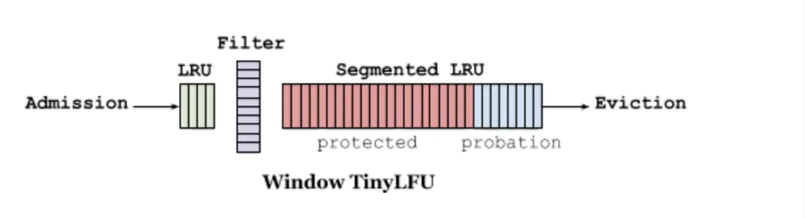

Data Structure and Algorithm in Rust

**Double Linked List**

[double_linkedlist.rs](./src/double_linkedlist.rs)

**HEAP**

[heap.rs](./src/heap.rs)

**LRU**

[lru.rs](./src/lru.rs)

**Concurrent LRU**

[concurrent_lru.rs](./src/concurrent_lru.rs)

**Count-Min Sketch**
[count_min_sketch.rs](./src/count_min_sketch.rs)

**Tiny LFU**

go verison: https://github.com/dgryski/go-tinylfu